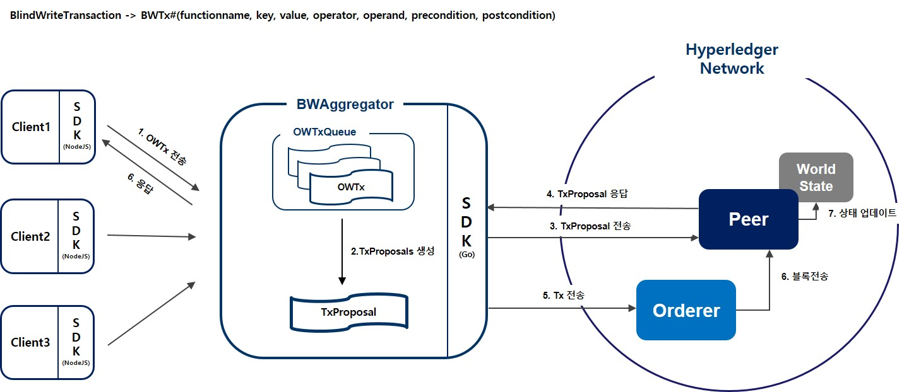

# hyperledger_project
하이퍼레저 패브릭 MVCC문제 해결방안에 대한 학위논문 및 구현 
주제: Blind Write 트랜잭션을 활용한 하이퍼레저 패브릭 MVCC 충돌 회피 방법 
(Hyperledger Fabric MVCC Collision Avoidance Method Using Blind Write Transactions)
___
## 문제
하이퍼레저 패브릭에서 EOV(Execute-Order-Validate)의 트랜잭션 처리방식으로 인해 동일한 키에 동시에 접근하는 트랜잭션이 증가 할수록 **충돌이 발생하는 빈도가 늘어남.** 즉, 동일한 키에 Read-Write하는 트랜잭션들이 동일한 블록에 들어가 **'invalid'되는 비율이 높아지는 것이 문제임**
  
 
 

## 한계점
위에 정의한 문제점으로 인해, **특정 유형의 서비스를 구현하는데 한계가 있음.** 예를 들어, 정해진 시간안에 한정된 수량의 물건을 구매하는 서비스(특가 판매)처럼 트랜잭션이 특정 키에 순간적으로 동시에 접근할 수 밖에 없는 서비스 유형(투표, 경매) 해당됨.
  
 
 

## 개선방안(요약)
* Client가 전송한 연산 행위가 기록된 트랜잭션은 하이퍼레저 네트워크에 도착하기 전 외부에서 일정 시간 동안 모아 **트랜잭션에 내에 readset이 없이 writeset만** 있을 수 있도록 할 수 있는 **하나의 트랜잭션으로 바꿔 Peer에게 전송한다**
* 하나의 트랜잭션으로 바꾸기 전 사전, 사후 검사를 통해 조건에 충족되지 않는 트랜잭션은 Client에게 reject 한다.
* Peer에게 전송한 트랜잭션은 기존 패브릭에서 처리되는 것처럼 동일하게 처리된다.
 

## System Architecture
 
 

