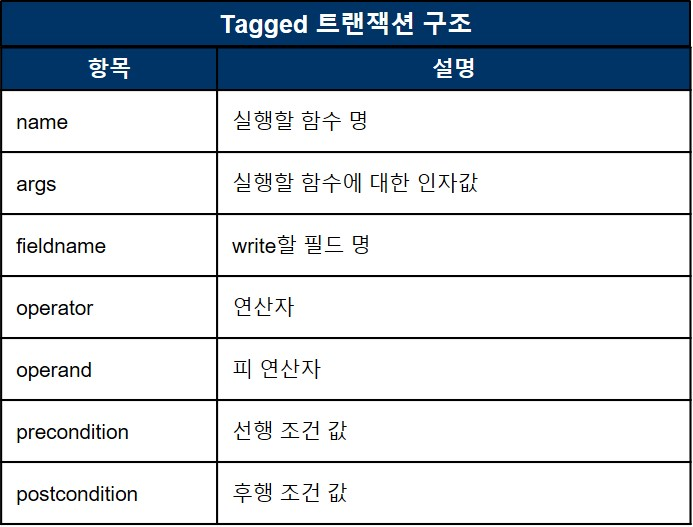

# hyperledger_project
하이퍼레저 패브릭 MVCC문제 해결방안에 대한 학위논문 및 구현<br>
주제: Blind Write 트랜잭션을 활용한 하이퍼레저 패브릭 MVCC 충돌 회피 방법  
(Hyperledger Fabric MVCC Collision Avoidance Method Using Blind Write Transactions)
___
## 문제
* 하이퍼레저 패브릭에서 EOV(Execute-Order-Validate)의 트랜잭션 처리방식으로 인해 동일한 키에 동시에 접근하는 트랜잭션이 증가 할수록 **충돌이 발생하는 빈도가 늘어남.**
* 즉, 동일한 키에 Read-Write하는 트랜잭션들이 동일한 블록에 들어가 **'invalid'되는 비율이 높아지는 것이 문제임**
<br><br>
<br>
<br>

## 한계점
* 위에 정의한 문제점으로 인해, **특정 유형의 서비스를 구현하는데 한계가 있음.**
* 예를 들어, 정해진 시간안에 한정된 수량의 물건을 구매하는 서비스(특가 판매)처럼 트랜잭션이 특정 키에 순간적으로 동시에 접근할 수 밖에 없는 서비스 유형(투표, 경매) 해당됨.
* 아래는 체인코드로 콘서트 티켓을 구매한다고 가정하고 티켓 수량을 한개씩 차감하는 함수를 만들어 1000개의 트랜잭션을 동시에 전송시킴
* 그 결과, 1개의 트랜잭션을 제외하고 **999개의 트랜잭션이 모두 invalid된 것을 확인 하였음**
<br><br>
<br>
<br>

## 개선방안(요약)
* key를 read한 후 update하는 연산행위에 의해서 충돌이 자주 발생함
* Client가 전송한 트랜잭션(연산행위만 담겨 있음)은 하이퍼레저 네트워크에 도착하기 전 외부(BWAggregator)에서 일정 시간 동안 모아 **트랜잭션에 내에 readset이 없이 writeset만** 있을 수 있도록 할 수 있는 **하나의 트랜잭션으로 바꿔 Peer에게 전송한다**
* 하나의 트랜잭션으로 바꾸기 전 사전, 사후 검사를 통해 조건에 충족되지 않는 트랜잭션은 Client에게 Reject 한다.
* Peer에게 전송한 트랜잭션은 기존 패브릭에서 처리되는 것처럼 동일하게 처리된다.
<br>

## System Architecture
<br>
<br>

<br>

## 개선방안(상세)

### 1. Blind Write 트랜잭션 전송을 위한 fabric-sdk내 submitBWTransaction 함수 추가


* submitBWTransaction함수 실행시, Chaincode function name, Key, fieldname, Operator, Operand, Precondition, Postcondition에 대한 정보를 인자값으로 넘김
* 넘긴 인자값들을 활용하여 BWAggregator를 통해 Write할 값을 생성하여 TxProposal을 각 Peer(Endorser)에게 전송함
* 아래는 현재 fabric-sdk-node에서 트랜잭션을 전송할 수 있는 함수 및 신규 추가 함수(submitBWTransaction)를 의미함
```
submitTransaction: Send transaction for read-write(ex submitTransaction('BuyTicket', 'TICKET0'))
evaluateTransaction: Send read only transaction(ex evaluateTransaction('QueryAllTickets'))
submitBWTransaction: Send blind write transaction(ex submitBWTransaction('BuyTicket', 'Ticket0', 'Amount', operatorEnum.ADD, 1, 0, 1000))
```

<br>
<br>

### 2. Blind Write 트랜잭션 수집 및 처리를 위한 BWAggregator 설치

* Client가 전송한 BWTx를 BWAggregator에서 일정시간 동안 수집
* BlindWriteTransaction내의 operator, operand를 활용하여 각 키 별로 연산 후, 최종 write value를 생성하여 TxProposals를 각 Peer에게 전송함
* 이후 TxProposal 처리 방식은 기존 패브릭에서의 처리방식과 동일함
<br>

