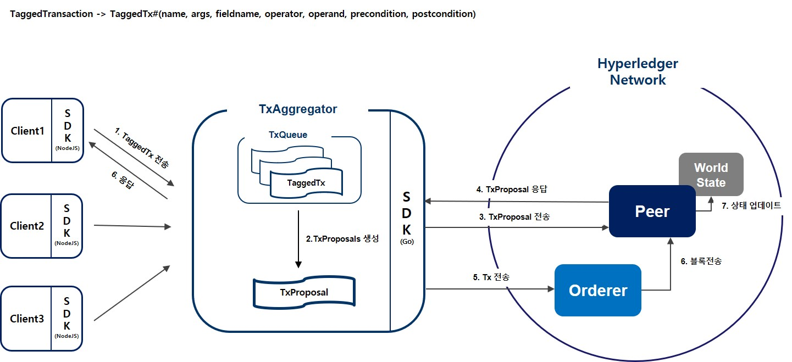

# hyperledger_project
하이퍼레저 패브릭 MVCC문제 해결방안에 대한 학위 논문 및 구현<br>
주제: 동일 키 트랜잭션 통합을 활용한 하이퍼레저 패브릭 MVCC충돌 회피 방법  
(A Hyperledger Fabric MVCC Avoidance Method Using Same-Key Transaction Integration)
___
## 문제
* 하이퍼레저 패브릭에서 EOV(Execute-Order-Validate)의 트랜잭션 처리방식으로 인해 동일한 키에 동시에 접근하는 트랜잭션이 증가 할수록 **충돌이 발생하는 빈도가 늘어남.**
* 즉, 동일한 키에 Read-Write하는 트랜잭션들이 동일한 블록에 들어가 **'invalid'되는 비율이 높아지는 것이 문제임**
<br><br>
<p align="center">
<br>
</p>
<br>

## 한계점
* 위에 정의한 문제점으로 인해, **특정 유형의 서비스를 구현하는데 한계가 있음.**
* 예를 들어, 정해진 시간안에 한정된 수량의 물건을 구매하는 서비스(특가 판매)처럼 트랜잭션이 특정 키에 순간적으로 동시에 접근할 수 밖에 없는 서비스 유형(투표, 경매) 해당됨.
* 아래는 체인코드로 콘서트 티켓을 구매한다고 가정하고 티켓 수량을 한개씩 차감하는 함수를 만들어 1000개의 트랜잭션을 동시에 전송시킴
* 그 결과, 1개의 트랜잭션을 제외하고 **999개의 트랜잭션이 모두 invalid된 것을 확인 하였음**
<br><br>
<br>
<br>

## 개선방안(요약)
* key를 read한 후 update하는 연산행위에 의해서 충돌이 자주 발생함
* Client가 전송한 트랜잭션(연산행위만 담겨 있음)은 하이퍼레저 네트워크에 도착하기 전 외부(BWAggregator)에서 일정 시간 동안 모아 **트랜잭션에 내에 readset이 없이 writeset만** 있을 수 있도록 할 수 있는 **하나의 트랜잭션으로 바꿔 Peer에게 전송한다**
* 하나의 트랜잭션으로 바꾸기 전 사전, 사후 검사를 통해 조건에 충족되지 않는 트랜잭션은 Client에게 Reject 한다.
* Peer에게 전송한 트랜잭션은 기존 패브릭에서 처리되는 것처럼 동일하게 처리된다.
<br>

## System Architecture

<br>
<p align="center">
<br>
</p>
<br>

## 개선방안(상세)

### 1. Tagged 트랜잭션 추가


* 키 통합이 필요한 트랜잭션은 Tagging하여 별도로 처리하며, Tagging한 트랜잭션을 Tagged 트랜잭션이라 함.
* fabric-sdk-node내 submitTransaction함수를 메소드 오버로딩(method overloading)하여 기존 name, args 매개변수 외에 Tagging할 정보인 fieldname, operator, operand, precondition, postcondition을 추가함.
* 매개변수가 추가된 즉, Tagging된 submitTransaction 함수는 Tagged 트랜잭션을 전송하며, 패브릭 네트워크로 전송하지 않고 TxAggregator로 전송함.
```
* Tagged  트랜잭션 구조

name: 실행할 함수명
args: 실행할 함수에 대한 인자값
fieldname: write할 필드 명
operator: 연산자
operand: 피 연산자
precondition: 선행 조건 값
postcondition: 후행 조건 값
```


<br>

### 2. Tagged 트랜잭션 수집 및 처리를 위한 TxAggregator설치

* 일정 시간동안 Client가 전송한 TaggedTx를 모음
* TaggedTxSet내의 operator, operand를 활용하여 각 키 별로 연산 후, 최종 write value를 생성하여 TxProposals를 각 Peer에게 전송함
* 이후 TxProposal 처리 방식은 기존 패브릭에서의 처리방식과 동일함
<br><br>
<br>

## 실험 결과
* 트랜잭션 개수가 증가 할 수록, 키 통합 전 대비 성능 개선 비율은 지속적으로 향상 되는 것을 알 수 있음
* 키 통합 overhead 시간은 트랜잭션 개수 증가 폭 대비 낮으며, 이를 통해 전체 실행시간 또한 키 통합 전 대비 증가 폭이 현저히 낮음을 알 수 있음

<p align="center">
<br>
</p>
